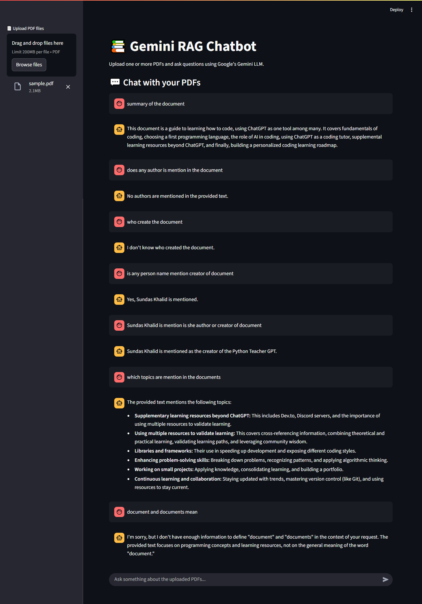

# 📄 PDF-RAG-Chatbot-Gemini  


💬 *"Ask your PDFs anything — powered by Google Gemini & LangChain magic."*  

A Retrieval-Augmented Generation (RAG) chatbot that lets you **upload PDFs** and **chat directly with their content**.  
Built using **LangChain**, **FAISS vector search**, and **Google Gemini API**, with a **Streamlit UI** for ease of use.

---

## 🚀 Features
- 📂 Upload any PDF document  
- 🔍 Context-aware Q&A from your documents  
- 🧠 RAG pipeline with FAISS vector store  
- 🤖 Powered by Google Gemini for intelligent answers  
- 💻 Simple and interactive Streamlit interface  
- 🔒 Environment variables for API security

---

## 📁 Folder Structure

PDF-RAG-Chatbot-Gemini/
│── app.py # Main Streamlit application
│── requirements.txt # Python dependencies
│── .env # Environment variables (not uploaded to GitHub)
│── .env.example # Example env file for reference
│── screenshot.png # App screenshot
│── README.md # Project documentation


---

## 🔑 Environment Variables
Create a `.env` file in the root directory:
```env
GEMINI_API_KEY=your_gemini_api_key_here

(You can copy .env.example and rename it to .env.)

⚙️ Installation & Usage
1️⃣ Clone the Repository

git clone https://github.com/<your-username>/PDF-RAG-Chatbot-Gemini.git
cd PDF-RAG-Chatbot-Gemini


2️⃣ Install Dependencies


pip install -r requirements.txt
3️⃣ Set Up Environment Variables


cp .env.example .env
# Then open .env and add your GEMINI_API_KEY
4️⃣ Run the App


streamlit run app.py
📸 Screenshot


🌟 Future Improvements
📚 Support for multiple PDFs at once

🗂 Save & load previous chat history

🌐 Deploy on Hugging Face Spaces & Streamlit Cloud

🔍 Add advanced search with hybrid retrieval (semantic + keyword)

📜 License
This project is licensed under the MIT License.

